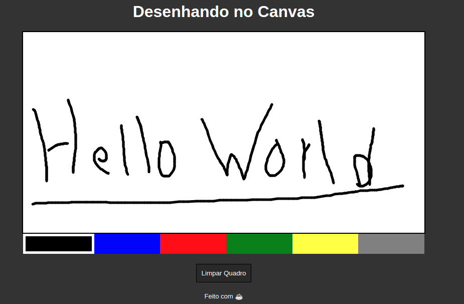

<h1 align="center">D7JS_DRAWING_BASE</h1>

    

# 📝 About this project

This project made with CANVAS to create an drawing board, to see more check documentation [docs](https://www.w3schools.com/html/html5_canvas.asp).

You see this project workin [here]()

# 🎨 Have Fun!